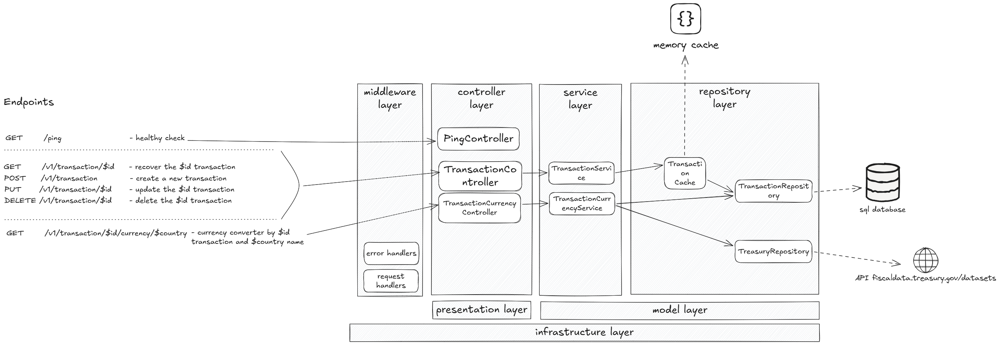
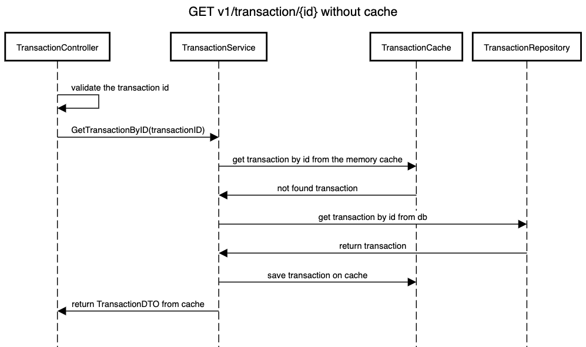
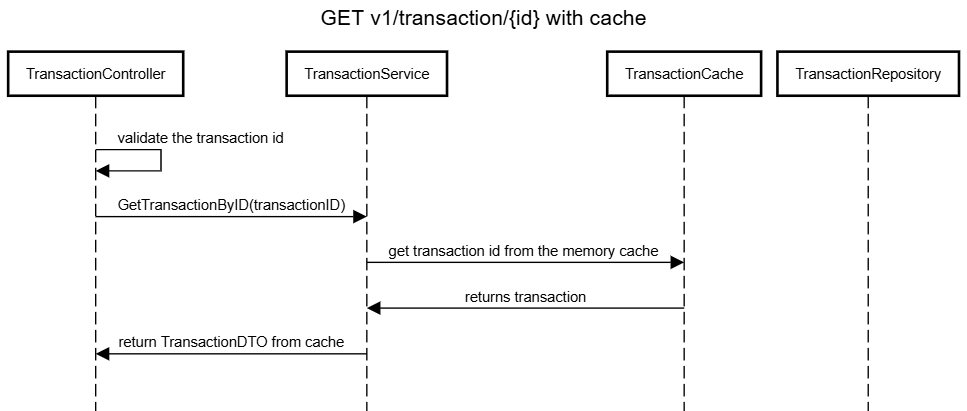
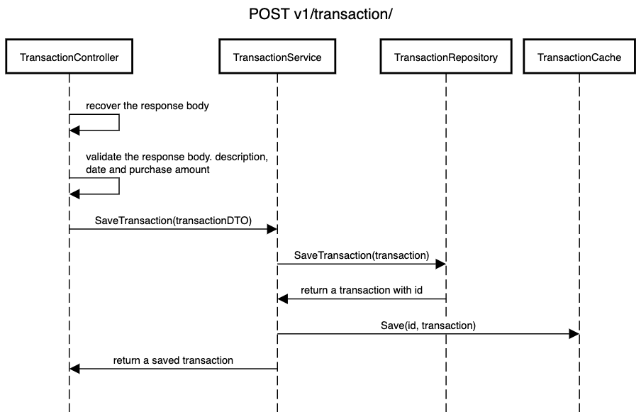
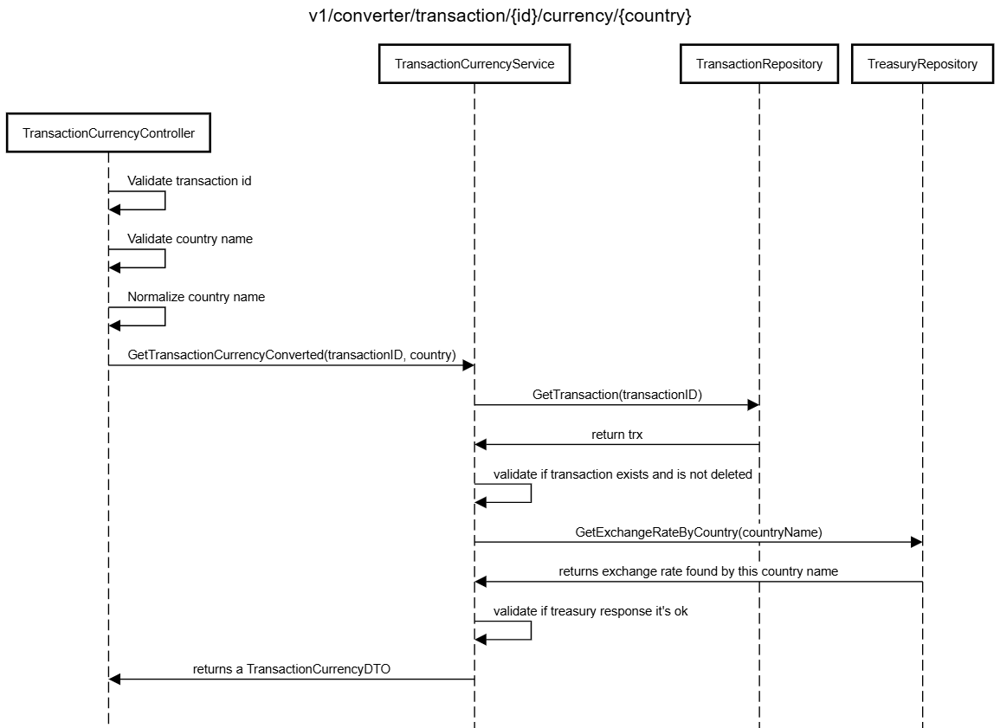

# transactions-api 
<br/> 
----

This is a Go API that communicate with [Treasury Reporting Rates of Exchange API](https://fiscaldata.treasury.gov/datasets/treasury-reporting-rates-exchange/treasury-reporting-rates-of-exchange) to recover the dollar exchange rate in other countries by reportings done by agencies of the government.

To validate this communication this API is a backend that delivers a transaction CRUD that is the simulation of a product purchase in dollars. In a transaction we need to inform: 
- description: some description about transaction
- transaction_date: a valid date
- purhcase_amount: in US-dollar

## Pattern

I choose to use a layered architecture for this project:
- It's a simple way to implement a project like this quickly;
- The API still remains with separated reponsabilitities which it is easy to mantain and test;
- If necessary, its easy to escalate for another architecture more robust.



## Data model

For this project I choose to use a simple table to store the transactions. The table contains the following fields:
```sql
CREATE TABLE IF NOT EXISTS transactions (
    id INTEGER PRIMARY KEY AUTOINCREMENT, -- auto incremented field starting from 1
    description TEXT NOT NULL,
    transaction_date TEXT NOT NULL,
    purchase_amount REAL NOT NULL,
    deleted INTEGER NOT NULL DEFAULT 0
);
```
This database run using a SQLite database, so no external dependencies is needed and the files can de founded in the `db/` and `scripts/` folder.

## Communication with external APIs

To communicate with the external API I choose to use the [http](https://pkg.go.dev/net/http) package from Go. This package is a simple way to make requests to external APIs and it's easy to use.
The communication with [Treasury Reporting Rates of Exchange API](https://fiscaldata.treasury.gov/datasets/treasury-reporting-rates-exchange/treasury-reporting-rates-of-exchange) was builded with the following parameters:

```
fields=record_date,country,exchange_rate,currency,effective_date&
filter=country:eq:%s&
sort=-record_date&
page[number]=1&
page[size]=1&
format=json
```
This guarantees that I will recover from the server only the necessary data and the most recent data from the country that I want to convert the currency.

## How to Run

This project run with a local database [sqlite](https://www.sqlite.org/) so no external dependencies is needed. <br/>
This project was built with go [v1.23](https://go.dev/dl/).<br>

To run this project just download the repository and inside the `cmd/` folder run the go program with the command: 
```sh
    go run main.go
```

## Endpoints

To help I [created this postman collection](docs/assets/transaction-api.postman_collection) <br/> 

**GET /ping**

#### Responses
- `200`: Server is alive
----
### Get transaction by ID

**GET /v1/transaction/{id}**

#### Parameters
- `id` (path, required): The ID of the transaction

#### Responses
- `200`: Transaction details
- `400`: Validations errors in request body and parameters
- `404`: Transaction not found
- `500`: Errors in stable communication with database
  
<br/>
<br/>

----
### Create a new transaction

**POST /v1/transaction**

#### Request Body
- `purchase_amount` (float, required): The amount of the transaction
- `description` (string, required): The description of the transaction
- `transaction_date` (string, required): The transaction date in the format YYYY-MM-DDTHH:mm:ssZ

#### Responses
- `201`: Transaction created
- `400`: Validations errors in request body and parameters
- `500`: Errors in stable communication with database

<br/>

----
### Update transaction by ID

**PUT /v1/transaction/{id}**

#### Parameters
- `id` (path, required): The ID of the transaction

#### Request Body
- `purchase_amount` (float, required): The amount of the transaction
- `description` (string, required): The description of the transaction
- `transaction_date` (string, required): The transaction date in the format YYYY-MM-DDTHH:mm:ssZ
  
#### Responses
- `200`: Transaction updated
- `400`: Validations errors in request body and parameters
- `404`: Transaction not found
- `500`: Errors in stable communication with database
----
### Delete transaction by ID

**DELETE /v1/transaction/{id}**

#### Parameters
- `id` (path, required): The ID of the transaction

#### Responses
- `200`: Transaction updated
- `400`: Validations errors in request body and parameters
- `404`: Transaction not found
- `500`: Errors in stable communication with database
----
### Get transaction currency conversion

**GET /v1/converter/transaction/{id}/currency/{country}**

#### Parameters
- `id` (path, required): The ID of the transaction
- `country` (path, required): The country name for currency conversion. The country names can be found [here](https://fiscaldata.treasury.gov/datasets/treasury-reporting-rates-exchange/treasury-reporting-rates-of-exchange).

#### Responses
- `200`: Currency conversion details
- `400`: Validations errors in request body and parameters
- `404`: Transaction or country not found
- `424`: Errors in stable communication with database
- `502`: Errors in stable communication https://fiscaldata.treasury.gov

<br/>
